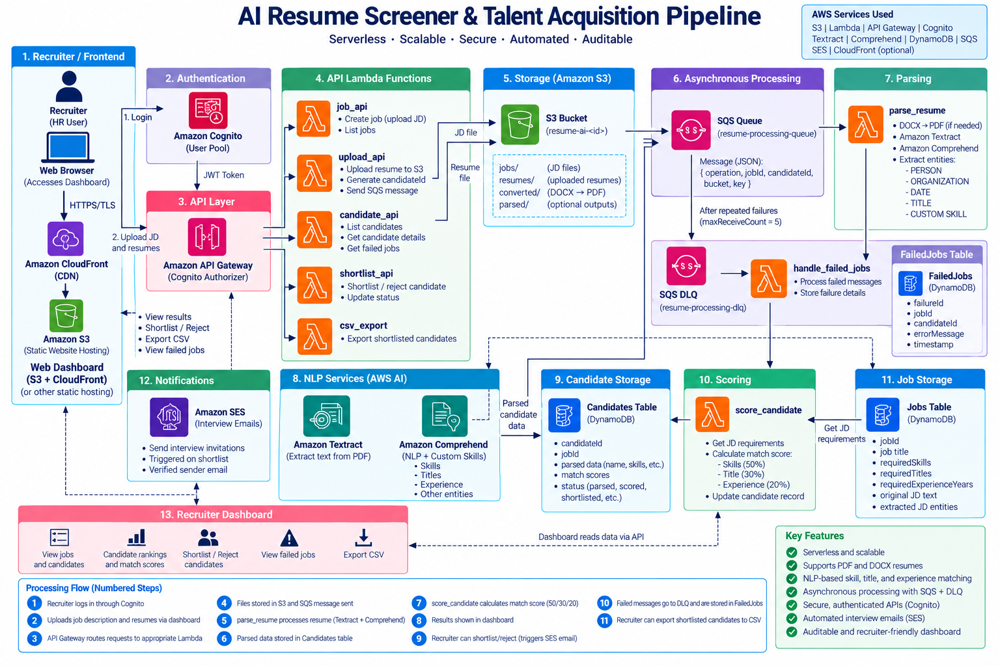
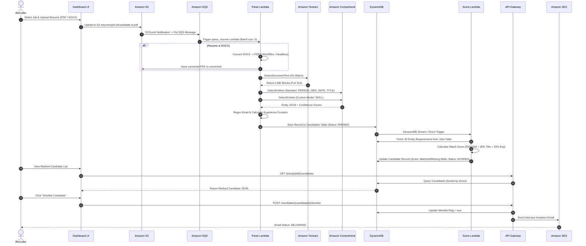

# AWS AI Resume Screener & Talent Acquisition Pipeline

[](https://aws.amazon.com/)
[](https://www.python.org/)
[](https://aws.amazon.com/textract/)
[](https://aws.amazon.com/comprehend/)
[](https://aws.amazon.com/dynamodb/)
[](https://aws.amazon.com/sqs/)
[](LICENSE)

An end-to-end, enterprise-grade serverless recruitment pipeline built on Amazon Web Services (AWS). The platform automates resume ingestion (PDF and DOCX), extracts structured candidate metrics using **Amazon Textract** and **Amazon Comprehend** (incorporating a custom-trained `SKILL` entity recognizer), ranks candidates against Job Descriptions (JDs) via an **explainable 50/30/20 scoring engine**, buffers high-concurrency traffic with **Amazon SQS / SQS DLQ**, and equips recruiters with an authenticated web dashboard (**Amazon Cognito** + **API Gateway**) featuring automated interview scheduling via **Amazon SES** and CSV exports.

---

## Table of Contents

1. [Executive Summary & Problem Statement](#executive-summary--problem-statement)
2. [Key Capabilities & Business Value](#key-capabilities--business-value)
3. [System Architecture](#system-architecture)
   - [Interactive Mermaid Architecture Diagram](#interactive-mermaid-architecture-diagram)
   - [ASCII Component Interaction Diagram](#ascii-component-interaction-diagram)
4. [AWS Services & System Design Rationale](#aws-services--system-design-rationale)
5. [End-to-End Processing Workflow](#end-to-end-processing-workflow)
   - [1. Ingestion & DOCX Normalization](#1-ingestion--docx-normalization)
   - [2. Text Extraction via Amazon Textract](#2-text-extraction-via-amazon-textract)
   - [3. Dual-Pass NLP Entity Extraction](#3-dual-pass-nlp-entity-extraction)
   - [4. Skill Normalization & Experience Parsing](#4-skill-normalization--experience-parsing)
6. [Explainable Scoring & Ranking Engine](#explainable-scoring--ranking-engine)
7. [Database Schemas (Amazon DynamoDB)](#database-schemas-amazon-dynamodb)
8. [Asynchronous Queuing & Resilience (SQS + DLQ)](#asynchronous-queuing--resilience-sqs--dlq)
9. [REST API Specification & Security](#rest-api-specification--security)
10. [Repository Structure](#repository-structure)
11. [Team Responsibilities & Work Breakdown](#team-responsibilities--work-breakdown)
12. [Testing Matrix & Quality Assurance](#testing-matrix--quality-assurance)
13. [IAM Security & Auditability Checklist](#iam-security--auditability-checklist)
14. [Cost Optimization & Resource Cleanup](#cost-optimization--resource-cleanup)
15. [Future Roadmap & Enhancements](#future-roadmap--enhancements)
16. [References & AWS Documentation](#references--aws-documentation)

---

## Executive Summary & Problem Statement

Talent acquisition teams manually process hundreds of resumes per job opening. Traditional screening workflows suffer from three primary bottlenecks:
* **Time Inefficiency**: Hours spent manually reading non-standardized PDF and DOCX files.
* **Inconsistent & Biased Evaluation**: Human fatigue leads to subjective evaluation criteria across candidates.
* **Operational Bottlenecks at Scale**: Peak hiring cycles create processing backlogs and delayed communication.

This project addresses these challenges by delivering an **auditable, scalable, serverless AI screening pipeline**. It automates candidate parsing and scoring using natural language processing (NLP) while retaining human control for final shortlisting and interview scheduling decisions.

---

## Key Capabilities & Business Value

* **Multi-Format Resume Support**: Native processing for PDF files and automated LibreOffice/Headless conversion for DOCX documents prior to OCR.
* **Custom Machine Learning Entity Extraction**: Combines Amazon Comprehend standard model (`PERSON`, `ORGANIZATION`, `DATE`, `TITLE`) with a **Custom Entity Recognizer** trained specifically to identify `SKILL` entities in technical resumes.
* **Explainable Matching Model**: Calculates a multi-factor score (50% Skill Match, 30% Title Alignment, 20% Experience Duration) to replace black-box AI predictions with transparent, auditable breakdown metrics.
* **Fault-Tolerant Asynchronous Pipeline**: Amazon SQS buffers concurrent resume uploads, while an SQS Dead Letter Queue (DLQ) captures malformed documents into a dedicated `FailedJobs` table.
* **Secure Recruiter Portal**: Recruiter authentication via Amazon Cognito User Pools, protected API Gateway endpoints, interview invitation automation through Amazon SES, and single-click CSV export.

---

## System Architecture



### Interactive Mermaid Architecture Diagram

```mermaid
flowchart TB
    subgraph Client["Recruiter Frontend"]
        UI["Recruiter Dashboard\n(S3 / CloudFront Static Hosting)"]
        Cognito["Amazon Cognito\n(User Pool Auth)"]
    end

    subgraph API_Layer["API & Security Layer"]
        APIGW["Amazon API Gateway\n(Cognito Authorizer)"]
        LambdaAPI["Backend API Lambdas\n(candidate_api, job_api, shortlist_api, csv_export)"]
    end

    subgraph Ingestion["Ingestion & Buffer"]
        S3["Amazon S3 Bucket\nresumes/ | jobs/ | converted/ | parsed/"]
        SQS["Amazon SQS\n(resume-processing-queue)"]
        DLQ["Amazon SQS DLQ\n(resume-processing-dlq)"]
    end

    subgraph Processing["AI Parsing Engine"]
        ParseLambda["parse_resume Lambda"]
        DocConverter["DOCX → PDF Converter\n(Lambda Layer / Container)"]
        Textract["Amazon Textract\n(DetectDocumentText)"]
        ComprehendStd["Amazon Comprehend\n(Standard Entities: PERSON, ORG, DATE, TITLE)"]
        ComprehendCustom["Amazon Comprehend\n(Custom SKILL Recognizer)"]
    end

    subgraph Scoring["Matching & Scoring Engine"]
        ScoreLambda["score_candidate Lambda"]
    end

    subgraph Persistence["Storage & Communication"]
        DDB_Candidates[("DynamoDB\nCandidates Table")]
        DDB_Jobs[("DynamoDB\nJobs Table")]
        DDB_Failed[("DynamoDB\nFailedJobs Table")]
        SES["Amazon SES\n(Interview Email Notification)"]
    end

    %% Flow Connections
    UI -->|1. Authenticate| Cognito
    Cognito -->|Token| UI
    UI -->|2. Direct Upload Resumes / JDs| S3
    UI -->|3. REST API Requests| APIGW
    APIGW --> LambdaAPI
    LambdaAPI --> DDB_Candidates
    LambdaAPI --> DDB_Jobs
    LambdaAPI --> DDB_Failed
    LambdaAPI -->|Shortlist Action| SES

    S3 -->|4. S3 Object Created Event| SQS
    SQS -->|5. Trigger Batch| ParseLambda
    ParseLambda -->|If DOCX| DocConverter
    DocConverter -->|Converted PDF| S3
    ParseLambda -->|6. Extract Raw Text| Textract
    Textract -->|7. OCR Text| ComprehendStd
    Textract -->|7. OCR Text| ComprehendCustom
    ComprehendStd -->|Standard Entities| ParseLambda
    ComprehendCustom -->|SKILL Entities| ParseLambda
    ParseLambda -->|8. Store Candidate Record| DDB_Candidates

    DDB_Candidates -->|9. Trigger Match| ScoreLambda
    DDB_Jobs -->|Fetch JD Entities| ScoreLambda
    ScoreLambda -->|10. Write 50/30/20 Match Score| DDB_Candidates

    SQS -.->|Repeated Failure (maxReceiveCount >= 5)| DLQ
    DLQ -->|11. DLQ Error Handler| DDB_Failed

    classDef aws fill:#FF9900,stroke:#232F3E,stroke-width:2px,color:#fff;
    classDef client fill:#232F3E,stroke:#FF9900,stroke-width:2px,color:#fff;
    class APIGW,S3,SQS,DLQ,ParseLambda,DocConverter,Textract,ComprehendStd,ComprehendCustom,ScoreLambda,DDB_Candidates,DDB_Jobs,DDB_Failed,SES,LambdaAPI aws;
    class UI,Cognito client;
```

---

### ASCII Component Interaction Diagram

```text
                               ┌──────────────────────────────────┐
                               │        RECRUITER DASHBOARD       │
                               │  (S3 / CloudFront Hosting + JS)  │
                               └────────────────┬─────────────────┘
                                                │
                                          Cognito Login
                                                │
                                                ▼
                               ┌──────────────────────────────────┐
                               │        AMAZON API GATEWAY        │
                               │   (Cognito Authorizer Protection)│
                               └────────────────┬─────────────────┘
                                                │
                 ┌──────────────────────────────┼──────────────────────────────┐
                 │                              │                              │
                 ▼                              ▼                              ▼
        [POST /jobs, Upload]           [GET /candidates]             [POST /shortlist]
                 │                              │                              │
                 ▼                              ▼                              ▼
             Amazon S3                      DynamoDB                     AWS Lambda
     (resumes/, jobs/, converted/)       (Candidates Table)                    │
                 │                                                             ▼
                 ▼                                                         Amazon SES
          Amazon SQS Queue                                            (Email Invitation)
                 │
         ┌───────┴───────────────┐
         ▼                       ▼
   (Valid Message)        (Poison Message)
         │                       │
         ▼                       ▼
   Parsing Lambda         Amazon SQS DLQ
         │                       │
 ┌───────┴───────┐               ▼
 │               │         FailedJobs Table
 ▼               ▼       (DynamoDB Audit Log)
PDF Resume   DOCX Resume
 │               │
 │          DOCX → PDF
 │               │
 └───────┬───────┘
         ▼
  Amazon Textract  ──────► Extracted Raw Text
                                 │
                 ┌───────────────┴───────────────┐
                 ▼                               ▼
        Amazon Comprehend               Custom Comprehend
        Standard Entities               SKILL Recognizer
    (PERSON, ORG, DATE, TITLE)               (SKILL)
                 │                               │
                 └───────────────┬───────────────┘
                                 ▼
                         DynamoDB Candidates
                                 │
                                 ▼
                          Scoring Lambda
                 ┌───────────────┼───────────────┐
                 ▼               ▼               ▼
            Skill Match        Title        Experience
               (50%)           (30%)           (20%)
                 │               │               │
                 └───────────────┼───────────────┘
                                 ▼
                        Final Candidate Score
                                 │
                                 ▼
                        Recruiter Dashboard UI
```

---

## AWS Services & System Design Rationale

| AWS Service | Core Purpose | System Design Rationale |
| :--- | :--- | :--- |
| **Amazon S3** | Object storage for resumes, JDs, and outputs | Provides durable storage with decoupled prefixes (`jobs/`, `resumes/`, `converted/`, `parsed/`) to isolate ingestion pipeline stages. |
| **AWS Lambda** | Event-driven serverless computing | Runs parsing, scoring, API logic, and notifications on demand with zero server administration overhead. |
| **Amazon Textract** | Optical Character Recognition (OCR) | Extracts structural text (`LINE` blocks) from multi-page PDF resumes accurately without manual rules. |
| **Amazon Comprehend** | Pre-trained Natural Language Processing | Extracts standard entities (`PERSON`, `ORGANIZATION`, `DATE`, `TITLE`) to identify candidate details and timeline data. |
| **Amazon Comprehend (Custom CER)** | Custom Entity Recognition for Skills | A custom-trained entity recognizer identifying domain-specific `SKILL` entities (e.g., Python, AWS Lambda, Docker, SQL) in resume text. |
| **Amazon DynamoDB** | Fully managed NoSQL database | Delivers single-digit millisecond latency for candidate records (`Candidates`), job descriptions (`Jobs`), and error logs (`FailedJobs`). |
| **Amazon SQS** | Asynchronous message queuing | Buffers high-volume resume uploads during bulk recruiting campaigns, decoupling upload latency from background processing. |
| **Amazon SQS DLQ** | Dead Letter Queue error isolation | Captures repeatedly failing messages (`maxReceiveCount >= 5`), preventing poison messages from blocking queue execution. |
| **Amazon Cognito** | Authentication & User Management | Secures recruiter access using JSON Web Tokens (JWTs) and user pool authorization. |
| **Amazon API Gateway** | Managed REST API entry point | Exposes secured HTTPS endpoints protected by Cognito Authorizers with throttling and CORS handling. |
| **Amazon SES** | Simple Email Service | Delivers structured interview invitation emails to shortlisted candidates upon recruiter approval. |
| **Amazon CloudWatch** | Observability & Auditability | Tracks Lambda performance metrics, SQS queue depth, and logs execution traces without recording PII. |

---

## End-to-End Processing Workflow



### 1. Ingestion & DOCX Normalization
Amazon Textract's `DetectDocumentText` API accepts PDF, JPEG, PNG, and TIFF formats, but **does not natively process DOCX files**. 
To preserve Textract OCR functionality without rejecting DOCX uploads, the ingestion pipeline normalizes documents:
* **PDF Uploads**: Transferred directly from `resumes/{jobId}/{candidateId}.pdf` to Amazon Textract.
* **DOCX Uploads**: Intercepted by the `parse_resume` Lambda, converted to PDF using a containerized LibreOffice conversion layer, stored under `converted/{jobId}/{candidateId}.pdf`, and then dispatched to Textract.

### 2. Text Extraction via Amazon Textract
The system issues an asynchronous/synchronous `DetectDocumentText` call to Textract. Textract parses document layouts, extracting raw text blocks:
```python
import boto3

textract = boto3.client("textract")
response = textract.detect_document_text(
    Document={"S3Object": {"Bucket": bucket, "Name": key}}
)

# Reconstruct ordered resume lines from Textract LINE blocks
lines = [
    block["Text"]
    for block in response.get("Blocks", [])
    if block.get("BlockType") == "LINE"
]
resume_text = "\n".join(lines)
```

### 3. Dual-Pass NLP Entity Extraction
Text extracted by Textract is evaluated through a dual NLP pipeline using Amazon Comprehend:
1. **Pass 1 — Pre-trained Comprehend Model**: Detects standard entities:
   * `PERSON`: Identifies candidate name.
   * `ORGANIZATION`: Extracts former employers and universities.
   * `DATE`: Identifies employment and education date ranges.
   * `TITLE`: Extracts designated candidate job roles.
2. **Pass 2 — Custom Entity Recognizer (`SKILL`)**: Processes the resume against a custom recognizer trained on domain-specific recruitment data to extract candidate technical skills (e.g., `Python`, `AWS Lambda`, `Docker`, `React`, `SQL`, `Kubernetes`).

### 4. Skill Normalization & Experience Parsing
* **Skill Normalization**: Raw skill entities undergo canonical mapping to prevent false negatives caused by string variations (e.g., `"Amazon Web Services"` $\rightarrow$ `"aws"`, `"React.js"` $\rightarrow$ `"react"`).
* **Deterministic Regex Parsing**: Extracted contact details (email addresses) are parsed using regex validation (`^[a-zA-Z0-9._%+-]+@[a-zA-Z0-9.-]+\.[a-zA-Z]{2,}$`).
* **Experience Calculation**: Extracted `DATE` entities connected to employment context are parsed into timeline ranges to calculate non-overlapping professional experience in years.

---

## Explainable Scoring & Ranking Engine

Rather than relying on non-transparent black-box scoring models, the candidate matching engine uses an auditable, weighted multi-factor formula:

$$\text{Final Score} = (\text{SkillScore} \times 0.50) + (\text{TitleScore} \times 0.30) + (\text{ExperienceScore} \times 0.20)$$

### Formula Breakdown

| Score Component | Weight | Calculation Method | Description |
| :--- | :---: | :--- | :--- |
| **Skill Match** | **50%** | $\left( \frac{\text{Matched Required Skills}}{\text{Total Required JD Skills}} \right) \times 100$ | Evaluates overlap between normalized candidate skills and mandatory JD skills. |
| **Title Alignment** | **30%** | Exact Match = `100%`<br>Related Role = `75%`<br>No Alignment = `0%` | Matches extracted candidate job titles against required target job titles. |
| **Experience Duration**| **20%** | $\min\left( \frac{\text{Candidate Experience Years}}{\text{Required JD Experience Years}}, 1.0 \right) \times 100$ | Compares total years of experience against JD requirements, capped at 100%. |

> [!NOTE]
> **Configurable Threshold**: Candidates achieving a **FinalScore $\ge$ 70%** (configurable via the `SHORTLIST_THRESHOLD` environment variable) are flagged for automatic shortlisting recommendation.

---

## Database Schemas (Amazon DynamoDB)

### 1. `Candidates` Table
* **Partition Key (PK)**: `JOB#{jobId}`
* **Sort Key (SK)**: `CANDIDATE#{candidateId}`

```json
{
  "jobId": "job-101",
  "candidateId": "cand-509",
  "name": "Ananya Rao",
  "email": "ananya.rao@example.com",
  "resumeKey": "resumes/job-101/cand-509.pdf",
  "parseStatus": "COMPLETED",
  "skills": [
    {"raw": "Amazon Web Services", "normalized": "aws", "confidence": 0.98},
    {"raw": "Python", "normalized": "python", "confidence": 0.95},
    {"raw": "Docker", "normalized": "docker", "confidence": 0.91}
  ],
  "employers": ["CloudTech Solutions", "DataCore Inc"],
  "titles": ["Senior Cloud Engineer"],
  "experienceYears": 4.5,
  "entities": {
    "PERSON": ["Ananya Rao"],
    "ORGANIZATION": ["CloudTech Solutions", "DataCore Inc"],
    "DATE": ["2020 - Present", "2018 - 2020"],
    "TITLE": ["Senior Cloud Engineer"]
  },
  "scoreBreakdown": {
    "skillScore": 100.0,
    "titleScore": 100.0,
    "experienceScore": 90.0,
    "finalScore": 98.0,
    "matchedSkills": ["aws", "python", "docker"],
    "missingSkills": []
  },
  "shortlistFlag": true,
  "status": "SHORTLISTED",
  "shortlistedAt": "2026-10-01T14:20:00Z"
}
```

### 2. `Jobs` Table
* **Partition Key (PK)**: `JOB#{jobId}`

```json
{
  "jobId": "job-101",
  "title": "AWS Senior Cloud Engineer",
  "descriptionKey": "jobs/job-101/jd.txt",
  "requiredSkills": ["aws", "python", "docker", "terraform"],
  "requiredTitles": ["cloud engineer", "devops engineer", "software engineer"],
  "requiredExperienceYears": 5.0,
  "status": "ACTIVE",
  "createdAt": "2026-10-01T09:00:00Z"
}
```

### 3. `FailedJobs` Table
* **Partition Key (PK)**: `FAILED#{timestamp}#{candidateId}`

```json
{
  "candidateId": "cand-999",
  "jobId": "job-101",
  "stage": "TEXTRACT_PARSING",
  "errorType": "UnsupportedDocumentException",
  "errorMessage": "File corrupt or invalid document format uploaded.",
  "sourceKey": "resumes/job-101/corrupt_file.xyz",
  "retryCount": 5,
  "createdAt": "2026-10-01T10:15:30Z"
}
```

---

## Asynchronous Queuing & Resilience (SQS + DLQ)

To handle unexpected spikes in resume submission volume without breaching API limits or Lambda execution timeouts, the system incorporates an **Amazon SQS message queue with a Dead Letter Queue (DLQ)** redrive mechanism:

1. **Upload Trigger**: S3 bucket upload notifications emit events to `resume-processing-queue`.
2. **Decoupled Buffer Payload**: SQS payload contains lightweight reference metadata:
   ```json
   {
     "operation": "PROCESS_RESUME",
     "jobId": "job-101",
     "candidateId": "cand-509",
     "bucket": "resume-ai-screener-bucket",
     "key": "resumes/job-101/cand-509.pdf"
   }
   ```
3. **Redrive & DLQ Handling**:
   * SQS `VisibilityTimeout` is set to **300 seconds** (matching Lambda max execution time).
   * `maxReceiveCount` is configured to **5 retries**.
   * Unprocessable ("poison") messages failing after 5 attempts automatically route to `resume-processing-dlq`.
   * A dedicated DLQ listener extracts error context and records detailed audit logs into the `FailedJobs` DynamoDB table for recruiter inspection.

---

## REST API Specification & Security

All backend API endpoints are exposed via **Amazon API Gateway** and secured using an **Amazon Cognito User Pool Authorizer**. Clients must include a valid HTTP Authorization Header:
`Authorization: Bearer <Cognito_JWT_ID_Token>`

### API Reference Table

| HTTP Method | Resource Route | Description | Access Control |
| :--- | :--- | :--- | :--- |
| `POST` | `/jobs` | Create a job post and upload JD requirements | Cognito Authorizer |
| `GET` | `/jobs` | List active job postings | Cognito Authorizer |
| `GET` | `/jobs/{jobId}/candidates` | List candidate rankings sorted by `finalScore` | Cognito Authorizer |
| `GET` | `/candidates/{candidateId}` | Fetch detailed candidate profile & match breakdown | Cognito Authorizer |
| `POST` | `/candidates/{candidateId}/shortlist` | Shortlist candidate and trigger SES interview email | Cognito Authorizer |
| `POST` | `/candidates/{candidateId}/reject` | Reject candidate and update status | Cognito Authorizer |
| `GET` | `/jobs/{jobId}/shortlist.csv` | Export shortlisted candidates as a downloadable CSV | Cognito Authorizer |
| `GET` | `/failed-jobs` | Retrieve processing errors logged in `FailedJobs` table | Cognito Authorizer |

---

## Repository Structure

```text
aws-ai-resume-screener/
├── backend/
│   ├── parsing/
│   │   └── parse_resume.py         # Textract OCR + Comprehend entity parsing Lambda
│   ├── scoring/
│   │   └── score_candidate.py      # 50/30/20 Explainable candidate matching engine
│   ├── api/
│   │   ├── candidate_api.py        # Candidate management REST endpoints
│   │   ├── job_api.py              # Job description CRUD APIs
│   │   ├── shortlist_api.py        # Shortlist/reject actions + SES invocation
│   │   └── csv_export.py           # Shortlist CSV generation Lambda
│   └── shared/
│       └── constants.py            # Global configuration constants and schemas
│
├── frontend/                       # Recruiter Web Dashboard (React / Vite)
│   ├── src/
│   │   ├── components/             # Ranked candidate table, score tags, detail modal
│   │   ├── services/               # Cognito auth & API Gateway client integration
│   │   └── App.jsx
│   └── public/
│
├── training/                       # Amazon Comprehend Custom Entity Training
│   ├── skill_training_docs/        # Raw annotated training documents
│   └── annotations/                # SKILL entity CSV annotations
│
├── test-data/                      # Synthetic evaluation assets
│   ├── resumes/                    # Sample PDF and DOCX test resumes
│   └── jobs/                       # Sample Job Descriptions
│
├── README.md                       # System Architecture & Documentation
├── .gitignore                      # Git exclusion rules
└── requirements.txt                # Python dependencies (boto3, etc.)
```

---

## Team Responsibilities & Work Breakdown

| Team Member | Module Ownership | Key Focus Files & Infrastructure | Primary Deliverables |
| :--- | :--- | :--- | :--- |
| **Member 1** | **AI Resume Parsing Engine** | `backend/parsing/parse_resume.py`<br>`training/`<br>Amazon Textract & Comprehend | • S3 Bucket Ingestion & Prefixes<br>• DOCX $\rightarrow$ PDF Normalization<br>• Textract OCR & Custom `SKILL` Recognizer<br>• Candidate DynamoDB Record Ingestion |
| **Member 2** | **Matching, Scoring & Queue Reliability** | `backend/scoring/score_candidate.py`<br>Amazon SQS, DLQ & `FailedJobs` Table | • Job Entity Extraction & Normalization<br>• 50/30/20 Match Engine Implementation<br>• SQS Asynchronous Queue Integration<br>• DLQ Redrive Policy & Error Logging |
| **Member 3** | **Backend APIs, Security & Email** | `backend/api/`<br>Amazon Cognito, API Gateway, Amazon SES | • Cognito User Pool & App Client Setup<br>• Protected REST API Gateway Routes<br>• SES Interview Email Automation<br>• CSV Shortlist Export Endpoint |
| **Member 4** | **Recruiter Dashboard & Integration** | `frontend/`<br>UI Components & API Integration | • Authenticated Recruiter Web UI<br>• Candidate Score Visualizations & Tags<br>• Shortlist / Reject Action Handlers<br>• Failure Audit View & CSV Download |

---

## Testing Matrix & Quality Assurance

| Test ID | Test Scenario | Execution Vector | Expected Verification Result |
| :---: | :--- | :--- | :--- |
| **T01** | Valid PDF Processing | Upload PDF to `resumes/` | Textract parses `LINE` blocks; Comprehend extracts entities; candidate stored in DynamoDB. |
| **T02** | DOCX Normalization | Upload DOCX to `resumes/` | Lambda converts DOCX $\rightarrow$ PDF under `converted/`; Textract parses PDF successfully. |
| **T03** | Custom `SKILL` Recognition | Process resume with technical stack | Custom recognizer identifies skill entities with confidence scores $\ge 0.80$. |
| **T04** | 50/30/20 Match Scoring | Trigger `score_candidate` Lambda | Final score accurately calculated: 50% Skills + 30% Title + 20% Experience. |
| **T05** | High-Volume SQS Buffer | Batch upload 20 resumes | SQS buffers requests; Lambda consumes batches asynchronously without throttling. |
| **T06** | DLQ Error Capture | Upload corrupt document | Processing retries 5 times; message moves to DLQ; record logged in `FailedJobs`. |
| **T07** | API Authorization | Send HTTP request without token | API Gateway returns `HTTP 401 Unauthorized`. |
| **T08** | Shortlist & SES Email | Execute `POST /shortlist` | Candidate status updated to `SHORTLISTED`; candidate receives SES invitation email. |
| **T09** | CSV Export | Execute `GET /shortlist.csv` | Downloads CSV containing exclusively shortlisted candidate profiles. |

---

## IAM Security & Auditability Checklist

### Mandatory Least-Privilege IAM Policies

> [!IMPORTANT]
> Do not use wildcard `AdministratorAccess` execution roles in production environments. Enforce least-privilege IAM policies per component:

* **`parse_resume` Lambda Role**:
  * `s3:GetObject`, `s3:PutObject` on `arn:aws:s3:::resume-ai-*`
  * `textract:DetectDocumentText`
  * `comprehend:DetectEntities`, `comprehend:BatchDetectEntities`
  * `dynamodb:PutItem`, `dynamodb:UpdateItem` on `Candidates` table
  * `sqs:ReceiveMessage`, `sqs:DeleteMessage`, `sqs:GetQueueAttributes` on `resume-processing-queue`
* **`score_candidate` Lambda Role**:
  * `dynamodb:GetItem`, `dynamodb:Query`, `dynamodb:UpdateItem` on `Candidates` and `Jobs` tables
  * `sqs:ReceiveMessage`, `sqs:DeleteMessage`
* **`api_gateway` Execution Role**:
  * `lambda:InvokeFunction` for designated backend API Lambdas.

### Privacy & Auditability Standards
* **PII Protection**: Full resume raw text and candidate contact details are excluded from CloudWatch Logs to ensure compliance.
* **Idempotent Ingestion**: Candidate records use deterministic keys (`JOB#{jobId}` / `CANDIDATE#{candidateId}`) to prevent duplicate entries upon re-processing.

---

## Cost Optimization & Resource Cleanup

To maintain low operational costs during development:
1. **CloudWatch Log Retention**: Restrict CloudWatch log group retention to **7 days**.
2. **S3 Lifecycle Rules**: Implement expiration policies on temporary objects stored under `converted/` and `parsed/`.
3. **Comprehend Endpoints**: Teardown real-time Comprehend custom entity recognizer endpoints when active training or testing is complete.
4. **Cleanup Script**:
   ```bash
   # Empty temporary conversion artifacts from S3
   aws s3 rm s3://<your-bucket-name>/converted/ --recursive
   aws s3 rm s3://<your-bucket-name>/parsed/ --recursive
   ```

---

## Future Roadmap & Enhancements

* **Semantic Embedding Match**: Integrate **Amazon Bedrock** (Titan Text Embeddings) to evaluate contextual similarity beyond exact entity matching.
* **Cover Letter Sentiment Analysis**: Incorporate Amazon Comprehend Sentiment Analysis as an auxiliary non-scoring candidate insight.
* **Multi-Lingual Resume Parsing**: Extend Textract and Comprehend multi-language capabilities to process non-English candidate applications.

---

## References & AWS Documentation

* [Amazon Textract DetectDocumentText API Reference](https://docs.aws.amazon.com/textract/latest/APIReference/API_DetectDocumentText.html)
* [Amazon Comprehend Custom Entity Recognition Guide](https://docs.aws.amazon.com/comprehend/latest/dg/custom-entity-recognition.html)
* [AWS Lambda with Amazon SQS Trigger Setup](https://docs.aws.amazon.com/lambda/latest/dg/services-sqs-configure.html)
* [Amazon API Gateway Cognito Authorizers](https://docs.aws.amazon.com/apigateway/latest/developerguide/apigateway-integrate-with-cognito.html)
* [Amazon SES API Reference](https://docs.aws.amazon.com/ses/latest/APIReference/API_SendEmail.html)

---

<p align="center">
  Developed for Enterprise AI Talent Acquisition Demonstrations. Built on AWS Serverless Architecture.
</p>
